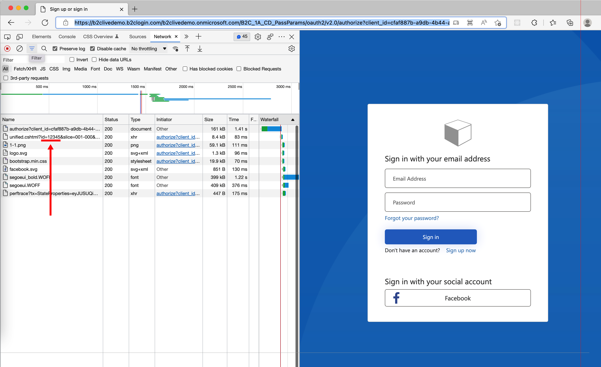

# Content definitions

This folder contains unit tests for Azure AD B2C content definitions. For more information, check out the [ContentDefinitions](https://docs.microsoft.com/azure/active-directory-b2c/contentdefinitions) article.

## How to pass custom query string parameters to the HTML template

Demonstrates how to pass custom query string parameters to the HTML template such as claim using [claim resolvers](https://docs.microsoft.com/azure/active-directory-b2c/claim-resolver-overview). The first orchestration step calls the *ExperimentalSetupTechnicalProfile* technical profile that set a default value to the *str1* claim. The *api.signuporsignin* content definition includes that claim in the `<LoadUri>` element. 

To test the policy run the [Live demo](https://b2clivedemo.b2clogin.com/b2clivedemo.onmicrosoft.com/B2C_1A_CD_PassParams/oauth2/v2.0/authorize?client_id=cfaf887b-a9db-4b44-ac47-5efff4e2902c&nonce=defaultNonce&redirect_uri=https%3A%2F%2Fjwt.ms&scope=openid&response_type=id_token&prompt=login) and check the browser network trace. 

 [Live demo](https://b2clivedemo.b2clogin.com/b2clivedemo.onmicrosoft.com/B2C_1A_CD_PassParams/oauth2/v2.0/authorize?client_id=cfaf887b-a9db-4b44-ac47-5efff4e2902c&nonce=defaultNonce&redirect_uri=https%3A%2F%2Fjwt.ms&scope=openid&response_type=id_token&prompt=login) &nbsp;  [Quick deploy](https://b2ciefsetupapp.azurewebsites.net/) &nbsp;  [Policy](CD_PassParams.xml) &nbsp;  [Documentation](https://docs.microsoft.com/azure/active-directory-b2c/customize-ui-with-html?pivots=b2c-custom-policy#dynamic-page-content-uri)