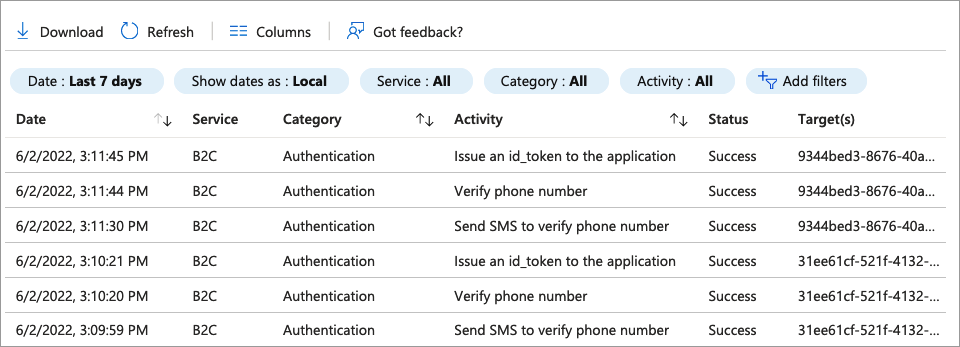

# Phone-factor technical profile

This folder contains unit tests for the Phone-factor technical profile. For more information, check out the [Define a phone factor technical profile in an Azure Active Directory B2C custom policy](https://docs.microsoft.com/azure/active-directory-b2c/phone-factor-technical-profile) article.

## Trigger the phone factor

The unit test asks to provide an email address and then run through the phone-factor technical profile.

The following screenshot shows the [Azure AD B2C audit logs](https://docs.microsoft.com/azure/active-directory-b2c/view-audit-logs) with the Phone-factor entries. The entries where the **target** starts with `31ee61cf-521f` the test run with a user that has a registered phone number. The second user where the **target** starts with `9344bed3-8676` without registered phone number.

The unit test defines the following components:

- *ExperimentalSetupTechnicalProfile* - Self-asserted technical profile where you provide the email address.
- *ExperimentalTechnicalProfile* - The unit test

 [Quick deploy](https://b2ciefsetupapp.azurewebsites.net/) &nbsp;  [Policy](TP_PhoneFactor.xml) &nbsp;  [Documentation](https://docs.microsoft.com/azure/active-directory-b2c/phone-factor-technical-profile)

